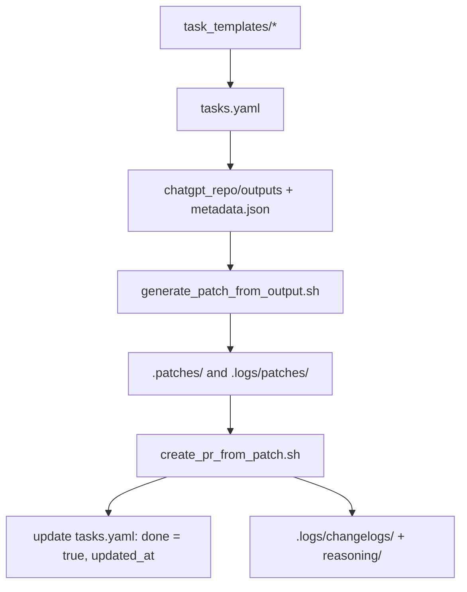

# AI-Native Task Management Framework

This document defines a scalable, AI-native framework for managing tasks across pods, phases, and sprints in a software delivery process. It integrates seamlessly with multi-pod execution, patch promotion, GPT-based task automation, and human oversight via the DeliveryPod GPT.

---

## 🧠 Core Concepts

| Concept | Description |
|--------|-------------|
| **task_templates/** | Canonical reusable tasks by SDLC phase and step |
| **tasks.yaml** | Unified backlog with task metadata including sprint and active status |
| **.logs/** | Stores metadata such as patch history, feedback, changelogs, and reasoning traces |
| **DeliveryPod GPT** | Custom GPT agent that serves as UI to manage tasks and orchestrate project planning with human |

---

## 🧩 Multi-Pod Task Support

This framework supports **parallel task execution** across multiple pods:

- Each task has metadata: `sprint: In-Sprint | Backlog`, `active: true | false`
- All task metadata lives in a single `tasks.yaml` for simplified state
- Patch scripts dynamically read from `chatgpt_repo/outputs/` and one `metadata.json`

---

## 📁 File Structure

```bash
project_root/
├── task_templates/
│   └── phase_1/1.1_capture_project_goals.yaml
├── tasks.yaml                # Unified project backlog
├── .patches/                 # Git patch files
├── .logs/
│   ├── patches/              # Patch metadata (json)
│   ├── changelogs/           # Task change history
│   └── reasoning/            # AI thought summaries
├── chatgpt_repo/
│   └── outputs/              # Raw GPT outputs (files only)
│   └── metadata.json         # Output metadata file used by patch script
└── scripts/
    ├── generate_patch_from_output.sh
    ├── create_pr_from_patch.sh
    └── complete_task.sh
```

---

## 🔄 Task Lifecycle



---

## 🛠️ Human + GPT DeliveryPod Workflow

### (1) Project Initiation
- Human runs `init_project_tasks.py` to generate `tasks.yaml` from templates

### (2) Sprint Planning Ceremony
1. Human gives GPT the prompt: _"List tasks pending or to-do for sprint planning."_
2. GPT retrieves `tasks.yaml`
3. GPT lists filtered tasks (e.g., status = pending or to-do)
4. Human selects tasks for the sprint
5. GPT updates and returns revised `tasks.yaml`
6. Human uses standard prompt to request final download block

### (3) Daily Standup
1. Human asks DeliveryPod for status update
2. GPT retrieves `tasks.yaml` and prints tasks by pod and status
3. Human selects next task
4. GPT returns:
   - Task prompt
   - Input file links
   - Output instructions with ZIP and `metadata.json`

### 🔁 Supporting Automation Rules
- `tasks.yaml` is the single source of truth for sprint, active, done
- `generate_patch_from_output.sh` reads from a single metadata.json and uses the staged outputs to create patch
- Changelogs and reasoning summaries are generated at PR time

---

## ✅ Automation Scripts

| Script | Role |
|--------|------|
| `init_project_tasks.py` | Seed `tasks.yaml` from `task_templates/` |
| `generate_patch_from_output.sh` | Generates patch from GPT output (based on `.logs/patches/metadata.json`) |
| `create_pr_from_patch.sh` | Applies patch, commits, pushes, and opens PR |
| `complete_task.sh` | Marks task as done, creates changelog + reasoning trace |

---

## 🤝 DeliveryPod GPT as UI & Orchestrator

### Custom GPT Actions

| Endpoint | Purpose |
|----------|---------|
| `/init_tasks` | Create `tasks.yaml` from templates |
| `/plan_sprint` | Return pending/backlog tasks to pick from |
| `/activate_task` | Update a task as active=true |
| `/get_prompt` | Return standard prompt for a given task and validate inputs |
| `/complete_task` | Mark task as complete and generate logs |
| `/monitor_pods` | Return status of all active tasks |

---

## ✨ Next Steps

- [x] Hide metadata in a ZIP process with `metadata.json`
- [ ] Auto-generate changelog and reasoning trace per task
- [ ] Improve PR readability with GPT-generated template
- [ ] Enable prompt replays for debugging or iteration


---

# Updated Task Framework 
- **Current State Recap**
  - **Task Templates (`task_templates/PhaseX/task.yaml`)**
    - One file per standard task (e.g., `1.1_capture_project_goals`)
    - Defined under a top-level key `tasks`
    - Used as a template, not as the source of truth
  - **Master Backlog (`task.yaml` at project root)**
    - Holds all actual project tasks (merged + customized from templates)
    - Accessed by:
      - `generate_patch_from_output.sh` to retrieve `category` and `pod_owner`
      - `complete_task.sh` to mark `done: true` and update `status`
    - Currently edited manually (or partially updated during patch flow)
  - **Current Patch Flow**
    - Reads task info from `task.yaml` (master)
    - Automatically updates `done` and `status` fields post-patch
    - No syncing or initialization from `task_templates` yet
  - **Minor Missing Pieces**
    - No mechanism to filter, assign, or group tasks by phase, pod, or status
    - No helper to initialize `task.yaml` from `task_templates`

- **MVP Task Management Requirements (Refined)**
  - **Core Needs**
    - Initialize `task.yaml` by compiling all `task_templates` (scripted, not manual)
    - Track task lifecycle: `status: backlog | up next | in progress | done`
    - Track who/what is working on each task (`pod_owner`, `assigned_to`)
    - Support cloning/customizing task templates for multiple uses
    - Provide filtering/sorting tools (by phase, pod, category, status)
    - Enable human-pod conversations to plan task order, assignments, and tailoring
    - Allow task updates based on script events (e.g., patch promotion)
  - **Optional (Future)**
    - Audit log (`updated_by`, `history`)
    - Dependencies between tasks (simple DAG or tags)
    - Integration into a Streamlit UI or command-line planner

- **🔄 Updated AI-Native Task Management Process**

  1. **💾 Step 0: Initialization (One-Time Setup)**
     - Human Lead runs: `python scripts/init_tasks_from_templates.py`
     - Outputs a unified `task.yaml` at the root of the repo
     - Each task includes:
       - `status: backlog`
       - `instance_of`: path to the original template
       - `assigned_to`: default is `unassigned`

  2. **🧑‍💻 Step 1: View & Plan with DeliveryPod**
     - Human Lead opens a chat with DeliveryPod GPT
     - GPT reads `task.yaml` (via `getGitHubFile` or batch-file access)
     - Human and GPT:
       - Filter tasks by `status`, `pod`, or `phase`
       - Identify which task to prioritize next

  3. **🛠️ Step 2: Activate or Customize Task**
     - GPT proposes changes (e.g., renaming, reassignment, tailoring prompt)
     - GPT calls `update_task_metadata` action to:
       - Change `status: in progress`
       - Clone and rename task (e.g., `1.1a_capture_product_goals`)
       - Modify `description`, `prompt`, `pod_owner`, etc.
     - **💡 Requirements:**
       - New OpenAPI tool: `update_task_metadata`
       - Patch to `main.py` to support task file read/write
       - Custom GPT action in manifest
       - Prompt template for updating or cloning tasks

  4. **🔁 Step 3: Work and Complete the Task**
     - Pod completes the task and finalizes outputs
     - Patch script auto-updates:
       - `done: true`
       - `status: done`
       - `updated_at` timestamp

  5. **📊 Step 4: Monitor + Report via DeliveryPod**
     - Human Lead can ask:
       - “What’s in progress?”
       - “What’s next for DevPod?”
       - “Which tasks are still unassigned?”
     - GPT responds using task data from `task.yaml` via `getBatchFiles`
     - **💡 Note:** No backend UI needed for MVP — this stays human-chat-native.

- **✅ Revised Implementation Plan**


|#|	Task|	Description|
|---|---|---|
|✅ 1|	init_tasks_from_templates.py	|Generate master task.yaml by merging task_templates/**/task.yaml|
|✅ 2|	Normalize task lifecycle states	|Adopt `status: backlog`|
|✅ 3|	Add instance_of, assigned_to fields	|For traceability and pod collaboration|
|✅ 4|	New update_task_metadata tool	|FastAPI endpoint to update or clone tasks (by DeliveryPod GPT)|
|✅ 5|	Add prompt template for DeliveryPod	|Standard system prompt for viewing, editing, cloning tasks|
|✅ 6|	Ensure PR + patch scripts stay compatible	|Every change to task.yaml structure must be assessed for script impact|
|✅ 7|	Add scripts/list_tasks.sh (optional)	|CLI tool to view task summary, used in local dev/test|
|✅ 8|	Update docs	|Document new task lifecycle, GPT capabilities, and actions available|


✅ (1) Prioritized List of Task Management Tools (GPT Actions)

These tools will allow GPTs (especially DeliveryPod) to interact with task.yaml safely and repeatably, without full repo access.


🥇 Priority	GPT Action	FastAPI Route	Description
1.	**update_task_metadata**	POST /tasks/update-metadata	Update metadata fields (e.g., status, pod_owner, assigned_to, description) for a given task_id
2.	**clone_task**	POST /tasks/clone	Duplicate a task under a new ID (e.g., 1.1a_capture_project_goals) with optional edits
3.	**list_tasks**	GET /tasks/list	Return all tasks or filtered by phase, status, pod, etc.
4.	**get_task_details**	GET /tasks/{task_id}	Return full metadata for a single task
5.	**create_new_task**	POST /tasks/create	Allow GPTs to define new tasks from scratch (advanced use)
6.	**delete_task**	DELETE /tasks/{task_id}	Remove task from task.yaml (for admin or human-only use)
7.  **activate_task**	POST /tasks/activate	Mark a task as active (e.g., in progress) and update status


✅ The first tool update_task_metadata enables 80% of the real-world flows (e.g. activate a task, reassign it, update description).

🧠 (2) Our Iterative Dev Process (Repeat for Each Tool)

We’ll use this workflow for each tool:

1. Patch main.py to add the route logic
2. Patch openapi.json to expose it to the Custom GPT
3. Create a standard prompt (e.g. prompts/delivery/update_task_metadata.txt)
4. Register the GPT action in your manifest / custom GPT setup
5. Test it end-to-end inside the GPT chat

💡 We’ll track each tool in your AI-native task backlog with test scenarios and usage examples to make it reproducible across future projects.

# Task Flow (for metadata updates)

✅ Updated Output Flow

Human sends update command to GPT (DeliveryPod)
GPT calls /tasks/update-metadata
GPT saves returned task.yaml locally
GPT generates:
reasoning_trace.md
prompt_used.txt
metadata.json (with proper prompt field)
GPT zips it and returns:
chatgpt_repo/outputs/task_updates/patch_<task_id>_<timestamp>.zip
├── task.yaml
├── reasoning_trace.md
├── prompt_used.txt
└── metadata.json
Human runs generate_patch_from_output.sh


# Tracking meta-tasks (tasks for tasks)

Here’s a proposed protocol for when to include “tasks for tasks” (aka meta-tasks) in the main task.yaml backlog, so we strike the right balance between auditability, practicality, and traceability.

✅ When to Add Meta-Tasks to task.yaml


Criteria	Include in task.yaml?	Rationale
📦 Changes affect shared state	✅ Yes	If the task modifies shared data (e.g. task.yaml, memory.yaml, prompt templates, specs, etc.), it should be tracked like any other work
🧠 Involves substantive reasoning	✅ Yes	If the pod reflects, explains tradeoffs, or generates meaningful logic (e.g. update_task_metadata, define_prompt_guidelines)
🛠️ Triggers patch promotion process	✅ Yes	If the result is delivered as a .zip with metadata.json, prompt_used.txt, and reasoning_trace.md, we treat it as patch-worthy
🔁 Routine system call or non-material read op	❌ No	Tasks like list_tasks, get_task_details, or activate_task are instrumental actions. They're part of the flow, but don't change source files directly
🤖 Fully automated or ephemeral	❌ No	For example, a gh CLI call to view PRs, or viewing logs, or temporary data cleanup doesn’t merit a backlog entry
✅ Examples That Should Be Backlog Tasks


Task ID	Description
0.1_update_task_metadata	Material edit to a tracked task's fields
0.2_define_new_task_template	Adds a new kind of task to the repo
0.3_activate_task	Yes, if it includes updated task.yaml and prompt_used.txt in a patch
0.4_add_task_to_backlog	Adds a new task entry to the backlog
0.5_edit_prompt_template	Edits a canonical prompt, which other pods use
❌ Examples That Do Not Require a Task Entry


Route / GPT Action	Reason
list_tasks	Pure read
get_task_details	Pure read
activate_task	Only tracked if it generates patch and reasoning
delete_task	Should be authorized manually via Git / PR instead
🎯 Summary Protocol

Only include meta-tasks in task.yaml if they affect durable system state, require human review, or are part of the patch promotion process.
We treat these like first-class deliverables, complete with:

Prompt provenance
Reasoning trace
Manifest file
Git-integrated patch


---

update as of 2025-04-25

# 🧠 AI-Native Delivery: Task Framework

## 🧭 Purpose
This framework enables modular, repeatable, traceable management of work tasks within an AI-native delivery system. It supports both human and AI (ChatGPT Pod) collaboration across the full SDLC.

---

## 🧱 Core Concepts

### ✅ `task.yaml`
- Central backlog file stored in GitHub
- Source of truth for all project tasks
- Tracks task metadata: `task_id`, `phase`, `category`, `pod_owner`, `status`, `prompt`, `inputs`, `outputs`, `ready`, `done`, `created_by`, timestamps, etc.

### 📁 Folder Structure
```bash
.
├── task_templates/         # Source templates per SDLC phase
│   ├── Phase1_discovery/
│   ├── Phase2_dev/
│   ├── Cross-Phase/
│   └── ...
├── prompts/used/           # Human-provided prompt texts
│   ├── DevPod/
│   ├── QAPod/
│   └── ...
├── .logs/
│   ├── patches/            # Patch metadata
│   ├── changelogs/         # Task changelogs
│   └── reasoning/          # Reasoning traces
├── chatgpt_repo/outputs/   # ZIPs of output + metadata from Pods
└── task.yaml               # Master backlog
```

---

## ⚙️ Tools (FastAPI + GPT)

| Tool Name            | Route                          | Status   | Description |
|----------------------|----------------------------------|----------|-------------|
| `update_task_metadata` | `POST /tasks/update-metadata`   | ✅ Done  | Modify metadata fields in `task.yaml` |
| `clone_task`         | `POST /tasks/clone`             | ✅ Done  | Clone an existing task under a new ID |
| `list_tasks`         | `GET /tasks/list`               | ✅ Done  | Return all tasks or filtered subset |
| `activate_task`      | `POST /tasks/activate`          | ✅ Done  | Mark task as in progress + return prompt |
| `promote_patch`      | `POST /patches/promote`         | ✅ Done  | Package outputs, manifest, prompt trace |
| `get_task_details`   | `GET /tasks/{task_id}`          | 🔜 Next  | Return full metadata for a task |
| `create_new_task`    | `POST /tasks/create`            | 📝 Planned | Create a new custom task |
| `delete_task`        | `DELETE /tasks/{task_id}`       | 📝 Planned | Remove a task from the backlog |

---

## 🤖 GPT Development Flow (Human + Pod)

### 🧠 How You Work
1. Human Lead + GPT plan and review tasks
2. GPT Pod performs a task, generates output, reasoning, and metadata
3. GPT Pod uses `promote_patch` to zip + return manifest + instructions
4. Human Lead saves ZIP to `chatgpt_repo/outputs` and runs:
```bash
bash scripts/generate_patch_from_output.sh
```
5. Script updates `task.yaml`, commits changes, opens PR

---

## 🔐 Protocol: When Task Management Work Becomes a Task

Use `task.yaml` for tracking changes that are:
- **Material** to delivery planning or backlog
- **Collaborative** between Human Lead + GPT Pod
- **Repeatable** across similar projects or workflows

Examples:
- ✅ `0.1_update_task_metadata`
- ✅ `0.3_clone_task`
- ❌ `get_task_details` (non-material, quick lookup)
- ❌ `list_tasks` (used for filtering, not workflow)

---

## 🚀 Future Enhancements
- 🧱 Vector search over task descriptions
- 📋 Task scoring + prioritization tools
- 🧩 Dependency graph visualization
- 📣 Notifications or updates on active task state

---

## 📢 Summary
This task framework empowers structured, agile-like AI-native delivery. It blends human intent with AI execution, encourages modularity, supports traceability, and is already powering end-to-end task management — with fast iteration and clear handoffs.

Let’s keep shipping! 🚀
